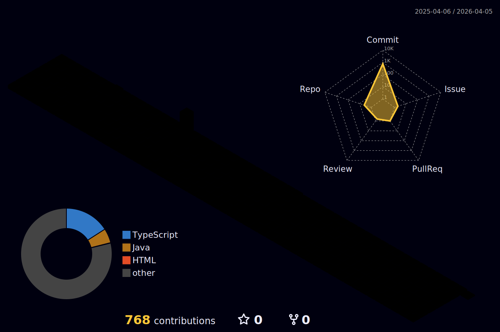

<!--
**Ohjinseo2022/Ohjinseo2022** is a ✨ _special_ ✨ repository because its `README.md` (this file) appears on your GitHub profile.

Here are some ideas to get you started:

- 🔭 I’m currently working on ...
- 🌱 I’m currently learning ...
- 👯 I’m looking to collaborate on ...
- 🤔 I’m looking for help with ...
- 💬 Ask me about ...
- 📫 How to reach me: ...
- 😄 Pronouns: ...
- ⚡ Fun fact: ...
-->
# 👋 Welcome to 오진서 GitHub!
안녕하세요! 저는 오진서 입니다. 문제해결을 즐기는 개발자입니다. 저의 GitHub에 오신 것을 환영합니다! 😊

---

---

---

---

